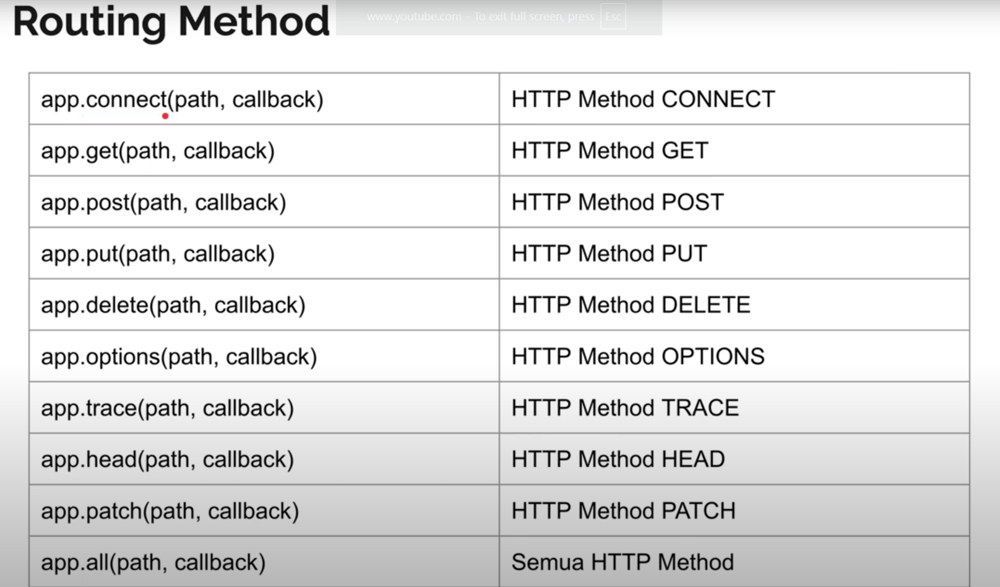

# Express.js Learning Project

A simple Express.js project demonstrating basic routing and API testing using Jest and Supertest.

## Prerequisites

- Node.js (v22.16.0 or later)
- npm (comes with Node.js)

## Routing Diagram


## Installation

1. Clone this repository
2. Install dependencies:

```bash
npm install
```

## Project Structure

```
├── src/
│   └── hello.js         # Main Express application
├── test/
│   ├── request.test.js        # Basic route tests
│   └── request-http.test.js   # Query parameter tests
├── babel.config.json
└── package.json
```

## Features

- Basic Express.js routing
- Query parameter handling
- Unit testing with Jest and Supertest
- ES Modules support
- Code coverage reporting

## Available Scripts

- Run tests:
```bash
npm test
```

## Test Coverage

The project is configured with Jest for 100% coverage requirements:
- Branches: 100%
- Functions: 100%
- Lines: 100%
- Statements: 100%

## API Endpoints

- `GET /` - Returns "Hello World"
- `GET /?name={name}` - Returns "Hello {name}"
- `GET /about` - Returns "Halaman About"

## Dependencies

- express: ^4.18.1
- supertest: ^7.1.4
- jest: ^28.1.0
- babel-jest: ^28.1.0

## Author

sseptiannaim

## License

ISC